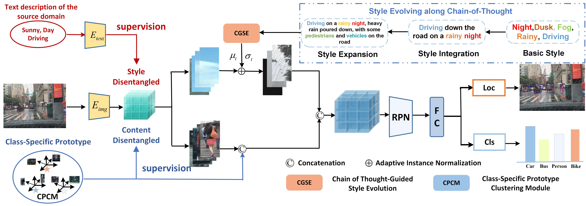

# Style Evolving along Chain-of-Thought for Unknown-Domain Object Detection

##### Official implementation of ["Style Evolving along Chain-of-Thought for Unknown-Domain Object Detection"], Zihao Zhang, Aming Wu, Yahong Han

